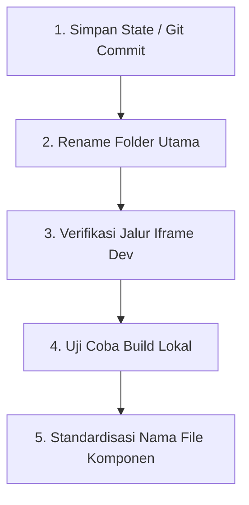

# Rencana Penataan Ulang Folder (Restructuring Plan)

Dokumen ini disusun untuk merapikan codebase project **after-hours** agar memiliki arsitektur yang jelas, mudah dipahami oleh developer manusia maupun AI agent, dengan tetap menjaga filosofi desain yang **handcrafted, artistic, dan immersive** tanpa merusak sistem yang sudah berjalan.

---

## 1. Rekomendasi Struktur Folder Final

Untuk memperjelas pemisahan tanggung jawab (*Separation of Concerns*) antara dunia 3D dan sistem OS retro di dalamnya, kita merekomendasikan perubahan nama folder root utama menjadi nama yang lebih deskriptif dan konsisten.

### Root Directory Structure

```text
after-hours/
├── workspace-3d/          # [RENAME] Sebelumnya 'portfolio-website' (Three.js World)
│   ├── bundler/           # Konfigurasi Webpack (Dev & Prod)
│   ├── server/            # Express Server untuk Production serving
│   ├── static/            # File statis 3D (3D Models, Textures, Audio, Fonts)
│   └── src/
│       ├── Application/   # Core Three.js Engine & World
│       │   ├── Audio/     # Spatially-aware audio controllers
│       │   ├── Camera/    # Camera system, transitions, & keyframes
│       │   ├── Shaders/   # GLSL shaders (coffee steam, CRT monitor filter)
│       │   ├── UI/        # High-fidelity HTML HUD overlays (React-based)
│       │   ├── Utils/     # Game-loop tickers, Resize observers, EventEmitters
│       │   └── World/     # 3D Meshes & Entity logic (Desk, Computer, Room)
│       ├── index.html     # Webpack HTML template
│       ├── script.ts      # Entrypoint 3D World
│       └── style.css      # Core global styles untuk 3D overlay
│
├── workspace-os/          # [RENAME] Sebelumnya 'portfolio-inner-site' (Retro 2D OS)
│   ├── public/            # File statis OS (Retro Icons, Wallpapers, game ROMs)
│   └── src/
│       ├── components/    # UI Components
│       │   ├── os/        # Core OS elements (Taskbar, Desktop, Window Manager)
│       │   ├── applications/ # Standard tools (Terminal, Notepad, Settings)
│       │   ├── showcase/  # Portofolio personal content (About, Experience, Projects)
│       │   ├── dos/       # MS-DOS simulation integration (js-dos)
│       │   ├── wordle/    # Custom Wordle mini-game
│       │   └── general/   # Reusable UI widgets (buttons, frames, retro-borders)
│       ├── hooks/         # Custom React hooks (window drag, state management)
│       ├── constants/     # Konfigurasi system, theme, file system layout
│       └── types/         # TypeScript declarations
│
└── docs/                  # Dokumentasi & Aturan Main AI Agent
    ├── ai-agent-rules.md  # Petunjuk khusus untuk AI Agent
    └── folder-restructuring-plan.md # File ini
```

---

## 2. Penjelasan Fungsi Setiap Folder Penting

### A. `workspace-3d/` (Dunia 3D Immersive)
*   **`src/Application/World/`**: Ini adalah "jiwa" dari lingkungan 3D. Setiap file mewakili objek fisik di dalam ruangan (misalnya, `Computer.ts` untuk model komputer, `CoffeeSteam.ts` untuk asap kopi, dan `MonitorScreen.ts` yang bertindak sebagai jembatan yang merender OS retro).
*   **`src/Application/Camera/`**: Mengatur sudut pandang kamera sinematik, transisi zoom ketika pengguna mengklik monitor, dan pergerakan halus (*tweening*).
*   **`src/Application/Shaders/`**: Menyimpan shader kustom GLSL. Ini memberikan efek visual "tactile" dan retro, seperti distorsi layar cembung (CRT) dan partikel asap kopi yang realistis.
*   **`src/Application/UI/`**: Lapisan overlay 2D HTML di atas kanvas 3D (misalnya, layar loading yang retro, tombol mute audio, dan info overlay). Menggunakan React minimalis yang disematkan langsung ke Three.js.

### B. `workspace-os/` (Retro OS Virtual)
*   **`src/components/os/`**: Mengatur interaksi Windowing System. Ini bertanggung jawab untuk membuat jendela aplikasi dapat diseret (*draggable*), ditutup, diminimalkan, dan disusun secara rapi di desktop virtual.
*   **`src/components/showcase/`**: Berisi konten portofolio utama Anda. Struktur di sini dibuat seperti aplikasi retro yang menyajikan data diri secara interaktif.
*   **`src/components/dos/` & `wordle/`**: Mini-game interaktif terisolasi yang diintegrasikan langsung ke sistem menu OS untuk memperkuat nuansa "weirdness" dan "handcrafted quality".

---

## 3. Naming Convention yang Konsisten

Untuk menghindari kebingungan nama file saat bekerja dengan tim atau AI agent, kita menetapkan aturan penamaan yang solid:

1.  **3D World (TypeScript OOP Style)**:
    *   **Class & Class-files**: Menggunakan `PascalCase` (contoh: `MonitorScreen.ts`, `CameraKeyframes.ts`).
    *   **Variables & Helper Functions**: Menggunakan `camelCase` (contoh: `initializeScreenEvents()`, `maxOffset`).
2.  **OS React App (Component-Driven Style)**:
    *   **React Components**: Menggunakan `PascalCase` (contoh: `Window.tsx`, `Taskbar.tsx`, `Software.tsx`).
    *   **Custom Hooks**: Selalu diawali kata `use` diikuti `camelCase` (contoh: `useWindowSize.ts`).
    *   **Styles & Assets**: Menggunakan `kebab-case` atau `camelCase` secara konsisten (contoh: `retro-border.css`).

---

## 4. Bagian Mana yang Sebaiknya Jangan Disentuh Dulu (⚠️ HIGH RISK)

Untuk menjaga agar *atmosphere*, *tactile feeling*, dan *cinematic interaction* tidak rusak, hindari mengutak-atik area berikut pada tahap awal:

*   **`workspace-3d/src/Application/World/MonitorScreen.ts`**: Ini adalah bagian paling sensitif. Di sinilah terdapat jembatan komunikasi iframe (`postMessage`) yang meneruskan pergerakan mouse dan penekanan tombol dari sistem OS retro ke Three.js agar kamera bisa merespons dengan dinamis.
*   **`workspace-3d/src/Application/Shaders/`**: Shader GLSL sangat bergantung pada kalkulasi matriks WebGL. Mengubahnya tanpa pengetahuan WebGL mendalam dapat menyebabkan layar monitor menjadi hitam atau efek asap pecah.
*   **`workspace-3d/bundler/`**: Konfigurasi Webpack sudah dioptimalkan khusus untuk memproses shader mentah (*glslify*) dan mem-bundle file model 3D besar secara efisien. Refactor konfigurasi ini bisa menyebabkan build gagal.

---

## 5. Bagian Mana yang Aman Dirapikan Sekarang (✅ LOW RISK)

Anda bisa mulai merapikan bagian-bagian berikut tanpa risiko merusak visual atau interaksi:

1.  **Mengubah nama folder root**: Mengubah `portfolio-website` menjadi `workspace-3d` dan `portfolio-inner-site` menjadi `workspace-os`.
2.  **Merapikan folder `docs/`**: Membuat panduan arsitektur dan dokumentasi (seperti file ini) agar mempermudah navigasi.
3.  **Standardisasi Naming File**: Mengoreksi file-file di dalam `workspace-os/src/components/` yang mungkin masih menggunakan huruf kecil agar seragam menggunakan `PascalCase`.
4.  **Membersihkan Dead Code**: Menghapus file boilerplate sisa template jika ada yang tidak terpakai (seperti `reportWebVitals.ts` jika tidak digunakan untuk monitoring).

---

## 6. Urutan Langkah Paling Aman untuk Merapikan Folder

Ikuti langkah bertahap ini untuk menjamin tidak ada fungsionalitas yang pecah:



1.  **Langkah 1: Amankan Kode saat Ini**
    Pastikan semua perubahan terbaru sudah di-commit ke Git.
    ```bash
    git add .
    git commit -m "style: persiapan penataan ulang folder"
    ```
2.  **Langkah 2: Ganti Nama Folder Root**
    Ganti nama folder secara fisik atau via CLI:
    *   `portfolio-website` -> `workspace-3d`
    *   `portfolio-inner-site` -> `workspace-os`
3.  **Langkah 3: Periksa Referensi Iframe**
    Buka `workspace-3d/src/Application/World/MonitorScreen.ts` dan pastikan port dev server tetap merujuk ke port yang benar (biasanya `localhost:3000` untuk React app di `workspace-os`).
4.  **Langkah 4: Jalankan Dev Server Secara Bersamaan**
    *   Di terminal 1 (`workspace-os`): `npm start` (berjalan di port 3000)
    *   Di terminal 2 (`workspace-3d`): `npm run dev` (berjalan di port 8080)
    *   Buka browser di `http://localhost:8080/?dev` untuk memastikan dunia 3D dapat memuat OS retro dengan sempurna.

---

## 7. Best Practice agar Tidak Merusak Project Existing

*   **Hindari Over-Engineering (Jangan membuat Monorepo Lerna/Turborepo)**: Meskipun membagi proyek menjadi dua sub-folder terlihat seperti monorepo, membiarkan keduanya menjadi aplikasi mandiri yang sederhana (tanpa workspaces terkomplikasi) jauh lebih baik untuk menjaga kesederhanaan dan filosofi handcrafted.
*   **Jangan gunakan Path Aliases secara berlebihan pada tahap awal**: Penggunaan `@/components/...` yang terlalu agresif membutuhkan perubahan konfigurasi tsconfig dan Webpack secara mendalam yang berisiko merusak sistem bundling yang sudah stabil. Gunakan relative path sederhana terlebih dahulu.
*   **Gunakan Query Parameter `?dev` untuk Pengecekan**: Pastikan mekanisme pemisahan URL produksi (`https://os.after-hours.dev/`) dan lokal (`http://localhost:3000/`) tetap bekerja menggunakan parser query param di `MonitorScreen.ts`.

## Artistic Direction

Project ini bukan:
- SaaS dashboard
- startup landing page
- AI futuristic interface

Project ini adalah:
- immersive digital workspace
- atmospheric personal environment
- cinematic interactive experience

Prioritas utama:
- atmosphere
- interaction feel
- tactile computing
- subtle branding
- emotional immersion

Jangan overdesign.
Jangan overanimate.
Jangan corporate-ify project.